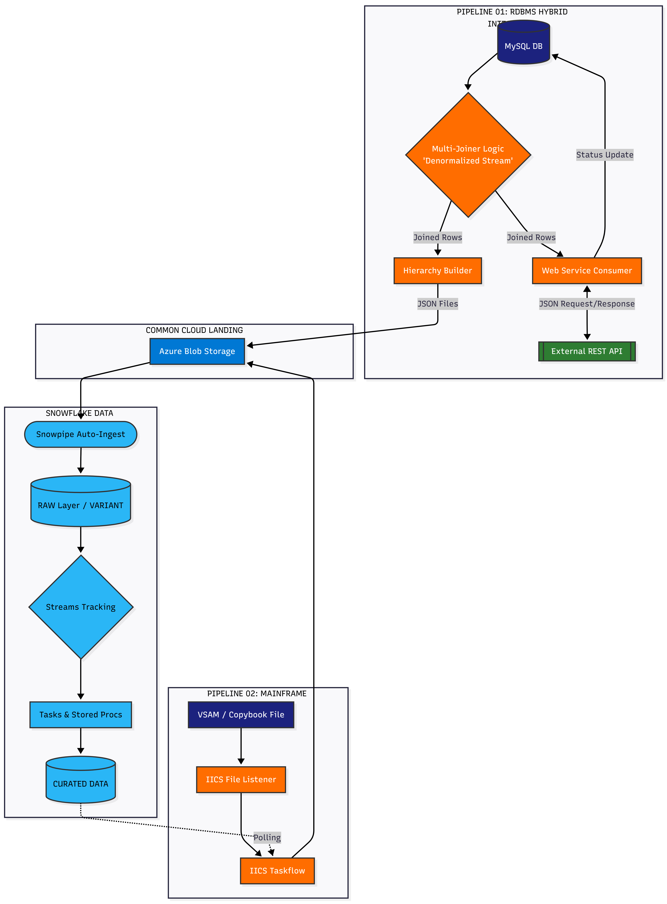

## Educational / Portfolio Project Disclaimer

This repository is an independently developed educational and portfolio project created in personal lab environments for learning and demonstration purposes.

It does not contain proprietary employer/client code, confidential business logic, production datasets, or internal enterprise assets. All workflows, datasets, pipelines, naming conventions, and configurations used in this repository are synthetic examples designed to simulate real-world z/OS modernization and DevOps scenarios.

The objective of this project is to demonstrate hands-on understanding of data integration from mainframes and databases like MYSQL using IICS, Snowflake, Azure and modernization practices within a controlled personal environment.

# Enterprise Data Pipelines (Mainframe Modernization | REST API | Cloud ETL)

  

This repository showcases **end-to-end cloud data pipelines built for modernizing legacy and relational data sources into Snowflake** using **Informatica Intelligent Cloud Services (IICS)** and **Azure Blob Storage**.

The pipelines demonstrate enterprise ingestion patterns including **event-driven processing, Snowpipe auto-ingestion, Streams/Tasks-based transformations, and RAW → CURATED data architecture**.

The primary focus of this project is **mainframe data modernization**, where complex **VSAM copybook datasets containing REDEFINES and OCCURS structures are parsed using the IICS IMS model and transformed into analytics-ready Snowflake tables**.

Each pipeline in this repository represents a real-world enterprise integration scenario and includes **IICS mappings, Snowflake SQL assets, Azure storage integration, and monitoring scripts**.

Hybrid Flow: Dual-path architecture handling both **real-time REST API synchronization** and high-volume **cloud data warehousing.**

API Orchestration: **Complex joins** (Users, Address, Geo, Company) to fulfill **nested JSON API contracts with a Synchronous Feedback Loop** to update source MySQL status.

Cloud Automation: Automated **Hierarchy Building** for **Azure Blob landing** and **Snowpipe-driven ingestion into Snowflake VARIANT tables.**

# Architecture Overview

Common architecture pattern used across pipelines:

_Source System_
→ IICS Extraction / Transformation
→ Azure Blob Storage (Landing Zone)
→ Snowpipe Auto-Ingest
→ Snowflake RAW Layer
→ Streams + Tasks Processing
→ Curated Tables
→ Monitoring & Audit

# Pipelines

### 01 - Multi-Pattern RDBMS Integration (API Sync & Cloud ELT)

### Path: pipelines/01_rdbms_rest_api_cloud_etl/

_Highlights:_

Hybrid Flow: Implements a dual-path architecture for real-time REST API synchronization and automated cloud data warehousing.

API Orchestration: Performs complex joins across 4+ tables to fulfill nested JSON contracts for downstream consumer APIs.

Transactional Feedback: Uses a synchronous loop to update the MySQL outbox table based on API response codes (201/400/500).

Automated Ingestion: Leverages Hierarchy Builder for JSON serialization and Snowpipe for event-driven loading into Snowflake.

CDC & Curation: Utilizes Snowflake Streams and Tasks for incremental MERGE-based upserts into curated relational structures.

---

### 02 - VSAM → IICS → Azure Blob → Snowflake (Mainframe Modernization)

### Path: pipelines/02_mainframe_modernization_vsam_to_snowflake/

This pipeline demonstrates mainframe modernization patterns for migrating complex VSAM copybook data structures into Snowflake.

_Highlights:_

VSAM batch file ingestion using IICS file listener

Parsing complex copybooks containing REDEFINES and OCCURS

IICS IMS model used to normalize hierarchical structures

Data split into Header / Detail / Trailer datasets

Files written to Azure Blob process container

Snowpipe automatically loads data into RAW Snowflake tables

Streams + Tasks + Stored Procedures transform data into curated structures

End-to-end pipeline monitoring using OPS.ETL_AUDIT_RUN audit table

IICS polls Snowflake audit table to determine pipeline success/failure

---

Integration Patterns Comparison
| Feature | Pipeline 01 (RDBMS/API) | Pipeline 02 (Mainframe/Audit) |
| :--- | :--- | :--- |
| **Source** | MySQL (Relational) | VSAM (Legacy/Copybook) |
| **Pattern** | API-Led Sync & Cloud ELT | Event-Driven Modernization |
| **Key Tech** | Web Service, Hierarchy Builder | IMS Model, Persistent Variables |
| **Storage** | MySQL / Azure Blob / Snowflake | Azure Blob / Snowflake |

---

### Repository Structure

<pre>
architecture/
  ├── pipeline_01_arch_flow_A.png
  ├── pipeline_01_arch_flow_B.png
  ├── pipeline_01_mapping_flow_A.JPG
  ├── pipeline_01_mapping_flow_B.JPG
  ├── pipeline_02_arch.png
  ├── pipeline_02_mapping.JPG
  ├── pipeline_02_taskflow.JPG
  └── repo.overview.png

pipelines/
  ├── 01_rdbms_rest_api_cloud_etl/
  └── 02_mainframe_modernization_vsam_to_snowflake/

shared/
  └── monitoring/
</pre>

# Each pipeline contains:

_azure/_ → storage setup and configuration
_iics/_ → exported IICS mappings and taskflows
_snowflake/_ → SQL scripts for stages, pipes, streams, tasks
_docs/_ → architecture notes and pipeline design
_sample_data/_ → test datasets and copybooks

# Security Notes

No credentials or secrets are stored in this repository.

Sensitive configurations such as:

Azure storage credentials

Snowflake account parameters

IICS connection details

must be supplied through environment variables or secure configuration management.

# Technologies Used

Mainframe VSAM Data
Informatica Intelligent Cloud Services (IICS)
Azure Blob Storage
Snowflake Data Cloud
Snowpipe Auto-Ingest
Snowflake Streams & Tasks
SQL Data Transformation
Git Version Control

# Purpose of This Repository

This project demonstrates enterprise data engineering patterns used in mainframe modernization initiatives, including:

Legacy data extraction and parsing

Cloud-based ingestion pipelines

Automated transformation workflows

Scalable Snowflake warehouse architecture

End-to-end pipeline monitoring and auditability

## How to review IICS code??

To review the logic, import the ZIP files from the /export folder into your IICS environment.
