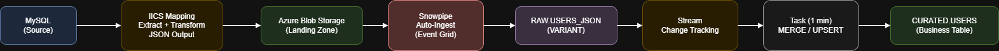

## Tech Stack

  

# Pipeline 01 — MySQL → IICS → Azure Blob → Snowflake

## Goal

Build an enterprise-style, automated pipeline that lands data in Azure Blob via IICS and automatically ingests it into Snowflake using Snowpipe, then curates it using Streams + Tasks.

## Architecture

MySQL → IICS Mapping → Azure Blob → Snowflake Stage → Snowpipe → RAW → Stream/Task → CURATED

## Snowflake Objects Created

- Warehouse: `WH_IISC`
- Database/Schemas: `IICS_DB.RAW`, `IICS_DB.CURATED`
- Stage: `AZ_IICS_STAGE` (points to Azure container/path)
- Pipe: `USERS_JSON_PIPE` (auto-ingest)
- RAW table: `RAW.USERS_JSON` (VARIANT + metadata)
- Stream: `RAW.USERS_JSON_STM`
- Task: `CURATED.USERS_UPSERT_TASK` (MERGE/upsert)
- CURATED table: `CURATED.USERS`

## Run Order (SQL)

Execute in this order (see `snowflake/` folder):

1. `01_infra/`
2. `02_storage_integration/`
3. `03_ingestion/`
4. `04_transformation/`
5. `05_data_quality/`
6. `99_monitoring/`

## Notes

- Azure SAS tokens must NOT be committed; use placeholders like `${AZURE_SAS_TOKEN}` and inject at runtime.
- JSON parsing: data is stored as VARIANT and parsed from `DATA:"Output"`.

See:

- `azure/notes.md`
- `iics/notes.md`
