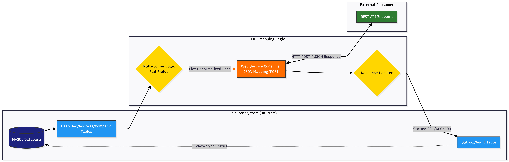
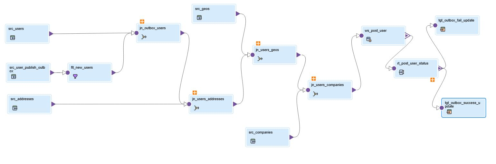
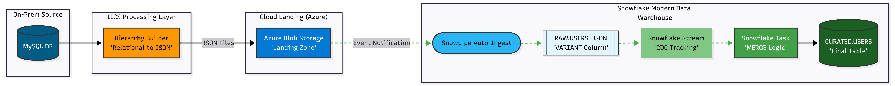
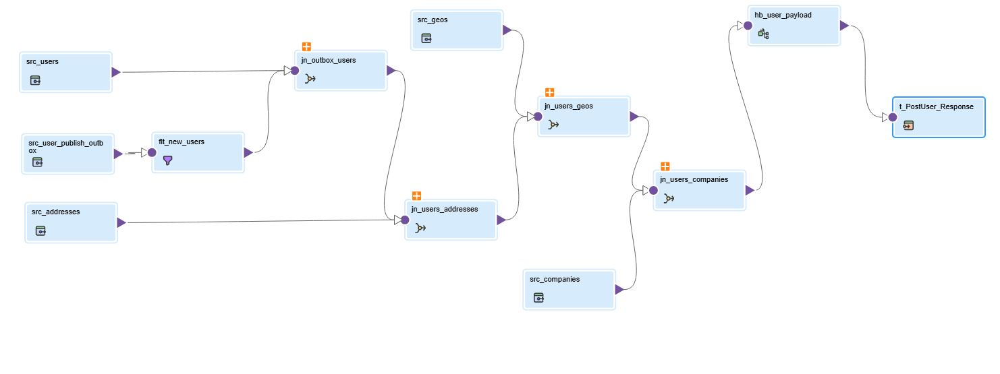

## Tech Stack

# Pipeline 01 — MySQL → Multi-Pattern Integration (API Sync & Cloud Ingestion)IICS → Azure Blob → Snowflake

## Goal

Build a production-grade, hybrid integration layer that synchronizes relational data across an enterprise ecosystem. This pipeline demonstrates two critical patterns: API-led Synchronization for real-time downstream updates, and Automated Cloud Data Loading where data is transformed into nested JSON, landed in Azure Blob Storage, and seamlessly ingested into Snowflake using Snowpipe, Streams, and Tasks for automated curation

## 🏗️ Architecture & Integration Flows

This pipeline implements two distinct architectural patterns to handle enterprise data requirements:

## Flow A:

API-Led Synchronization (Operational Sync)

Architecture

  

MySQL → IICS Joiner Logic → Web Service Consumer (REST) → Downstream API → Audit Response → MySQL Update

Purpose: Real-time synchronization of user profiles with external systems with a transactional feedback loop.

Mapping

  

  

MySQL → IICS Hierarchy Builder → Azure Blob Storage → Snowflake Stage → Snowpipe → RAW (Variant) → Streams/Tasks → CURATED (Structured)

Purpose: Automated, high-volume ingestion for semi-structured data warehousing and analytics.

Mapping

  
</p

## ❄️ Snowflake Data Strategy

Snowpipe: Configured for auto-ingestion from Azure Blob Stage.

Schema-on-Read: Data is loaded into a VARIANT column, allowing for seamless handling of the nested JSON structure shown above.

Curated Layer: A Snowflake Task executes a MERGE statement to flatten the JSON and upsert it into the final CURATED.USERS table.

## ❄️ Snowflake Objects Created

- Warehouse: `WH_IISC`
- Database/Schemas: `IICS_DB.RAW`, `IICS_DB.CURATED`
- Stage: `AZ_IICS_STAGE` (points to Azure container/path)
- Pipe: `USERS_JSON_PIPE` (auto-ingest)
- RAW table: `RAW.USERS_JSON` (VARIANT + metadata)
- Stream: `RAW.USERS_JSON_STM`
- Task: `CURATED.USERS_UPSERT_TASK` (MERGE/upsert)
- CURATED table: `CURATED.USERS`

## Run Order (SQL)

Execute in this order (see `snowflake/` folder):

1. `01_infra/`
2. `02_storage_integration/`
3. `03_ingestion/`
4. `04_transformation/`
5. `05_data_quality/`
6. `99_monitoring/`

---

## Notes

- Azure SAS tokens must NOT be committed; use placeholders like `${AZURE_SAS_TOKEN}` and inject at runtime.
- JSON parsing: data is stored as VARIANT and parsed from `DATA:"Output"`.

See:

- `azure/notes.md`
- `iics/component_manifests.md`
