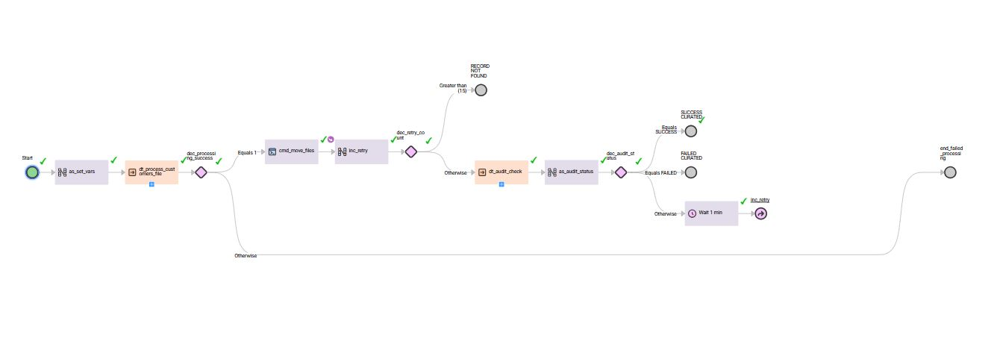
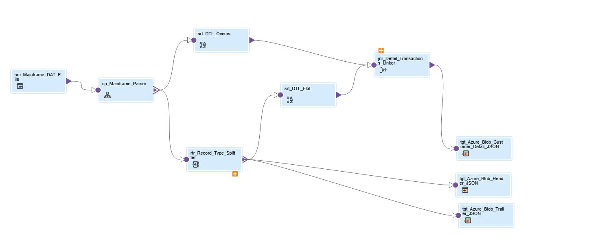

# VSAM → IICS → Azure → Snowflake Data Pipeline

  

### Mainframe Data Modernization with Event-Driven Ingestion

This pipeline demonstrates a **modern enterprise pattern for migrating mainframe VSAM batch data into Snowflake** using **Informatica Intelligent Cloud Services (IICS)** and **Azure Blob Storage**.

The solution handles **complex mainframe copybook structures** containing **REDEFINES and OCCURS clauses** and transforms them into **analytics-ready Snowflake curated tables** through a fully automated and event-driven pipeline.

---

# Pipeline Objective

The objective of this pipeline is to simulate a **real-world mainframe modernization scenario** where VSAM batch files must be ingested into a modern cloud data warehouse.

Key goals:

- Parse complex **VSAM copybook structures**
- Normalize hierarchical records
- Split transactional datasets into **Header / Detail / Trailer**
- Load data into **Snowflake RAW tables**
- Transform into **curated analytics-ready tables**
- Provide **end-to-end pipeline monitoring and audit**

The pipeline is designed to be **fully automated and event-driven**.

---

# Source System

Mainframe batch file (VSAM-style dataset)

Characteristics:

- Fixed width file generated using **COBOL copybook**
- Contains hierarchical record definitions
- Uses **REDEFINES and OCCURS clauses**
- Mixed record types (Header / Detail / Trailer)

Since direct mainframe connectivity was not available, **sample VSAM files were generated using Python based on the copybook structure**.

Location in repo:

sample_data/
copybook/
vsam_files/

---

# Architecture Overview

**High level flow:**

- Mainframe VSAM File lands in Azure Blob (Landing Container Root).
- IICS File Listener triggers the Taskflow upon file arrival.
- IICS Taskflow executes IMS Model Copybook Parsing.
- AzCopy Automation moves processed files from Root to process/ and archive/ folders.
- Snowpipe auto-ingests data into Snowflake RAW Tables.
- Snowflake Tasks transform data into Curated Tables.
- IICS Polls Snowflake Audit Table to determine final success/failure status.

---

# Technical Engineering Challenges

This project involved overcoming significant technical hurdles related to IICS limitations and cloud pathing:

- IICS Parameter Visibility (Data-Object vs String): Encounted a limitation where standard String In-Out parameters were not recognized
  in the Mapping Task (MCT) when using the Azure Blob V3 connection.

  **Solution:** Reconfigured the parameters as Data-Object types to ensure they were correctly exposed in the MCT and could be successfully passed to the Taskflow variables.

- Sub-folder Path Resolution (Object Not Found): Initially faced Invalid Path and Object Not Found errors when landing files in
  sub-folders, as the IICS File Listener struggled with nested directory depths on Azure containers.

  **Solution:** Standardized the ingestion by landing files at the Container Root and using AzCopy logic within a Command Task to dynamically route files to the correct process/ and archive/ sub-folders.

- The JSON Argument Bug: Resolved quote-parsing conflicts by implementing a Single-String Argument Strategy for passing JSON payloads to
  Windows Batch scripts.

- Synchronous Audit Feedback: Solved "blind execution" by using persistent variables to fetch Snowflake audit results back into the
  Taskflow for conditional branching.

---

# Event-Driven Pipeline Design

The pipeline is triggered automatically when a new VSAM batch file lands in Azure Blob storage.

**Trigger mechanism**

- Azure Blob landing container
- IICS File Listener monitors the landing location
- Taskflow automatically starts when a file is detected
- Post-Processing Automation: Integrated AzCopy to handle file movement, ensuring the Landing Root is cleared for the next batch,
  preventing recursive triggers.

This enables **near real-time ingestion without manual execution**.

---

# IICS Processing

## Taskflow

  

## Mapping

  

IICS performs the core transformation logic using IMS Model.

Key responsibilities:

- Parse complex VSAM copybook structures
- Handle **REDEFINES and OCCURS normalization**
- Transform hierarchical records
- Split records into multiple datasets

Output files generated:

- Header file
- Detail file
- Trailer file

These files are written to the Azure Blob **process folder** for Snowflake ingestion.

Folder structure:

azure/
landing/
process/
archive/

---

# Snowflake Data Processing

Once files are placed in the process folder, Snowflake automatically ingests them.

Processing steps:

1. Snowpipe detects new files in Azure Blob Storage
2. Files are loaded into **RAW tables**

RAW layer tables:

- RAW_HEADER
- RAW_DETAIL
- RAW_TRAILER

Streams monitor changes in RAW tables.

Snowflake Tasks then trigger transformation logic.

Transformation responsibilities:

- Data validation
- Record normalization
- Business rule application
- Data quality checks
- Merge into curated tables

Curated layer tables:

- CURATED_HEADER
- CURATED_DETAIL
- CURATED_TRAILER

---

# Pipeline Monitoring & Audit

A dedicated audit table tracks every pipeline execution.

_Audit table: ETL_AUDIT_RUN_

Closed-Loop Monitoring Logic:

- Snowflake updates the audit table with final status (SUCCESS/FAILED).

- IICS Mapping queries this status using the Batch_ID.

- Parameter Capture: Status is assigned to a Data-Object parameter to bridge it back to the Taskflow.

- Taskflow Decision: The pipeline branches based on this value to either finish successfully or trigger error alerts.

---

# Repository Structure

02_vsam_iics_azure_snowflake/

azure/
storage configuration and folder layout

iics/
exported mappings and taskflows

snowflake/
SQL scripts for stages, pipes, streams, tasks, and procedures

docs/
pipeline design notes and implementation details

sample_data/
copybook/
vsam_files/

---

# Key Engineering Highlights

- Mainframe **VSAM copybook parsing**
- Handling **REDEFINES and OCCURS structures**
- IICS **IMS model normalization and Structure Parser**
- Event-driven ingestion using **IICS File Listener**
- Automated cloud ingestion using **Snowpipe**
- Incremental transformations with **Streams + Tasks**
- Curated Snowflake data model
- End-to-end **pipeline audit and monitoring**

---

# Technologies Used

- Mainframe VSAM Data
- COBOL Copybooks
- Informatica Intelligent Cloud Services (IICS)
- Azure Blob Storage
- Snowflake Data Cloud
- Snowpipe Auto-Ingest
- Snowflake Streams & Tasks
- SQL Transformations
- Git Version Control

---

# Purpose of This Pipeline

This project demonstrates how organizations can **modernize legacy mainframe data pipelines** and integrate them with modern cloud data platforms.

It showcases real-world patterns used in enterprise data engineering initiatives such as:

- Mainframe data migration
- Cloud ingestion pipelines
- Automated transformation workflows
- Event-driven architectures
- Data warehouse modernization
